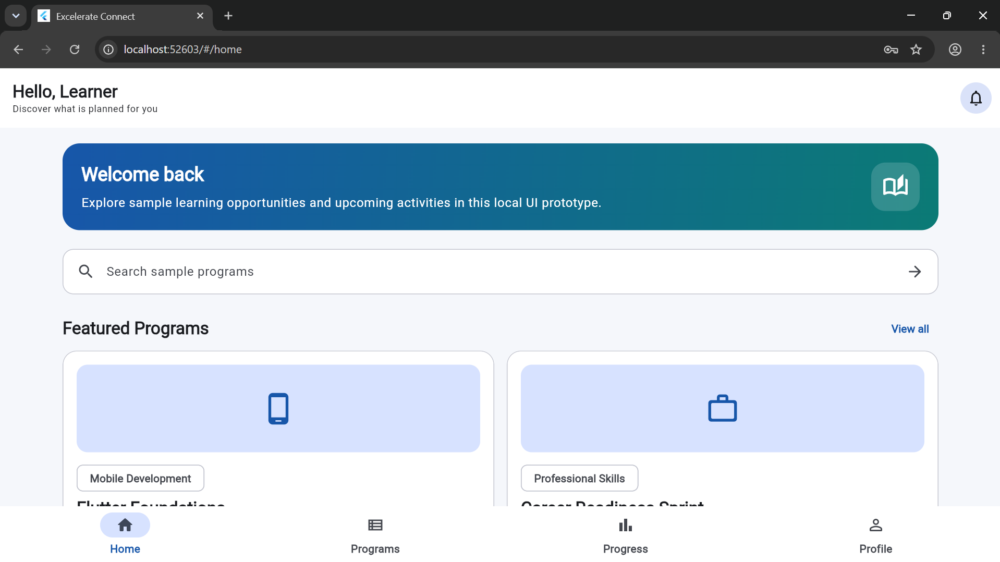
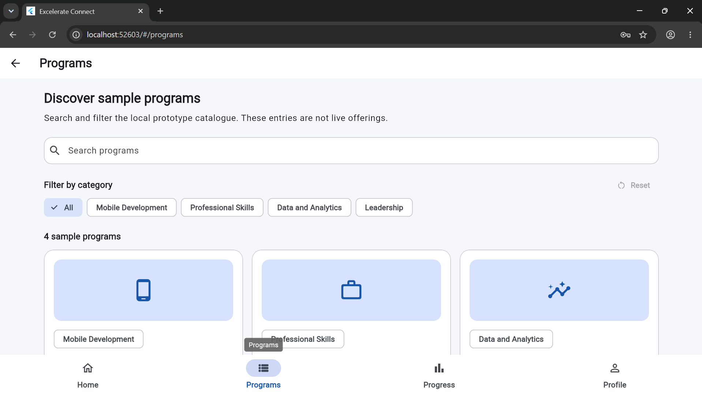
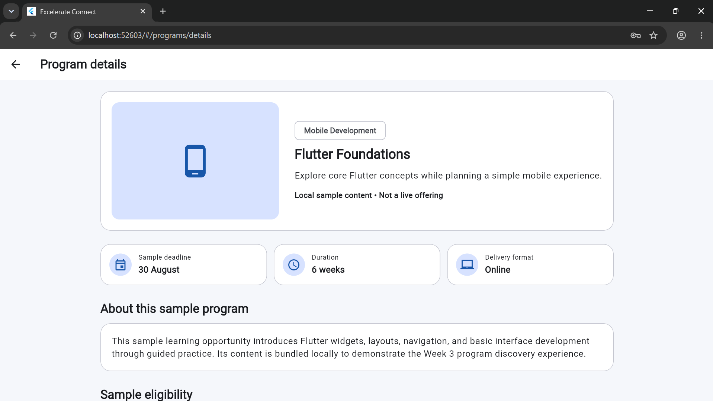
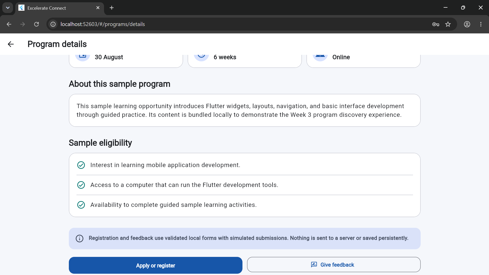
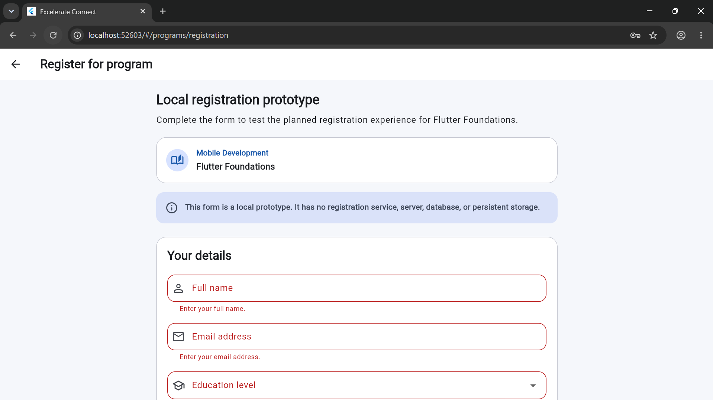
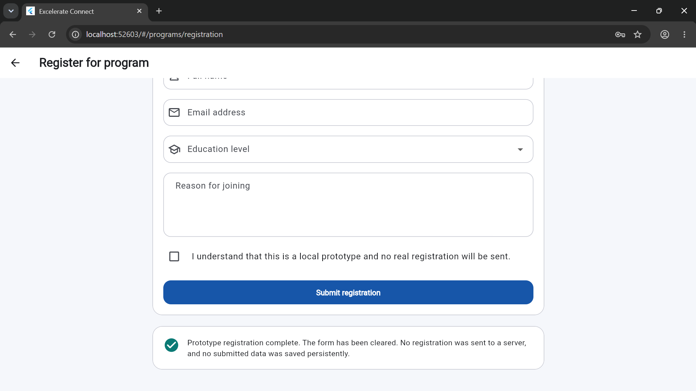
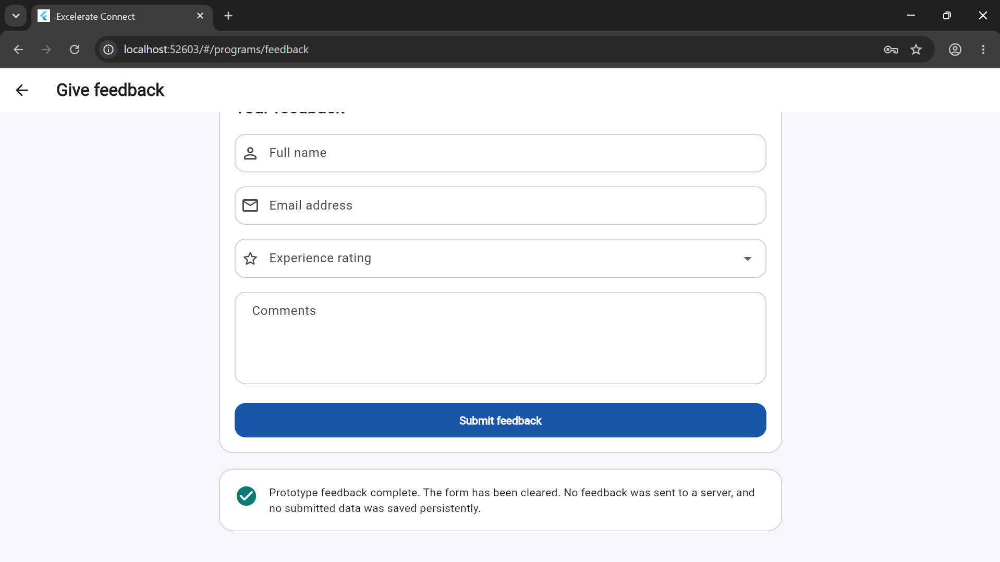
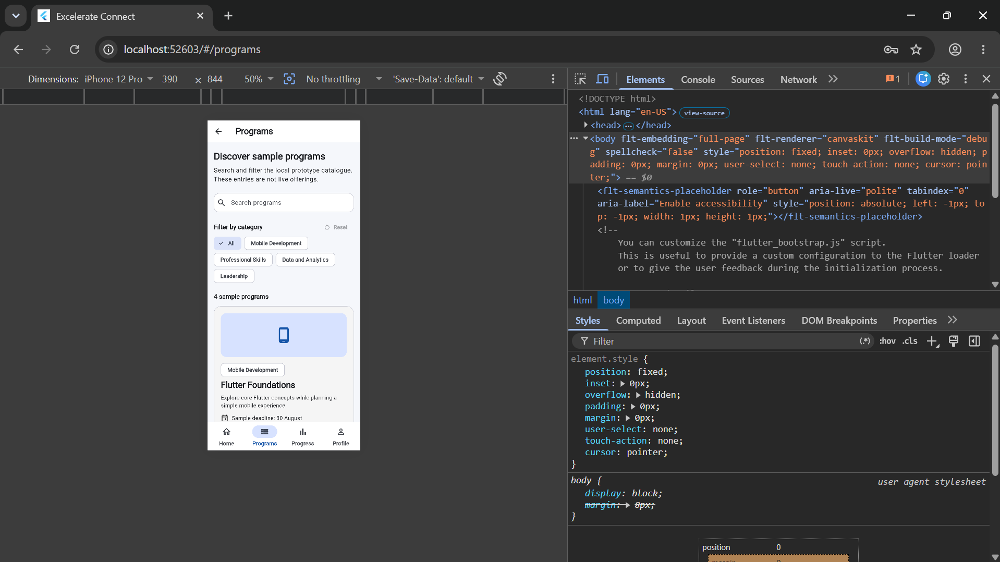

# Excelerate Connect

Excelerate Connect is a planned Flutter mobile application intended to help Excelerate learners discover programs and events, view program information and announcements, track learning progress, manage their profiles, and submit feedback. Future administrator capabilities are planned to support the management of programs, learner participation, announcements, and feedback.

> **Project status:** Week 3 development in progress. Week 1 established the proposal and low-fidelity wireframes, and Week 2 delivered the responsive Login, Home, Program Listing, and Program Details UI prototype. Week 3 now loads the local program catalogue from bundled JSON and adds validated registration and feedback form prototypes with simulated, temporary in-memory submission behavior. Backend-dependent and remaining learner and administrator capabilities are still planned.

## Problem Being Addressed

Learners need a clear, convenient way to find Excelerate learning opportunities, keep up with relevant events and announcements, follow their participation and progress, and provide feedback. Administrators also need an organized way to manage program information and learner participation. Excelerate Connect is planned as a centralized mobile experience that will address these needs in later development stages.

## Target Users

- **Learners:** Excelerate participants who want to discover programs, review details and announcements, monitor their learning progress, maintain a profile, and submit feedback.
- **Administrators:** Authorized users who will manage programs, announcements, learner participation, and feedback in later development stages.

## Feature Status

The current Week 3 local prototype includes:

- A Login Screen with local form validation and no real authentication
- A Home Screen whose Featured Programs load from the bundled program catalogue, alongside static sample events and announcement content
- A Program Listing Screen with loading, success, source-empty, filtered-empty, and error states; Retry; local search; category filters; reset controls; and a filtered result count
- A Program Details Screen that dynamically displays the selected Program object
- Responsive registration and feedback forms with inline validation, simulated submission loading, duplicate-submission prevention, success feedback, and form reset
- Temporary in-memory form behavior that clearly states nothing is sent to or stored by a server

The following capabilities remain planned:

- Real login, account creation, password recovery, and learner profile management
- Live program, event, and announcement data
- Real registration, enrollment, and feedback services or persistent submissions
- Learning progress tracking
- Notifications
- Administrator program and participation management

## Week 2 Working UI Prototype

Week 2 establishes a responsive four-screen Flutter prototype for the learner program-discovery journey. The implemented interface includes:

- **Login Screen:** Local email and password validation, password visibility control, and replacement navigation to Home
- **Home Screen:** Greeting, welcome content, static featured programs, sample events, a static announcement, quick links, and bottom navigation
- **Program Listing Screen:** In-memory search, category filters, reset and empty states, and responsive local program cards
- **Program Details Screen:** Selected-program descriptions, metadata, eligibility information, and transparent prototype action messages

The working navigation connects Login → Home → Program Listing → Program Details. Learners can also reach Programs from Home search, the Programs quick link, the View all action, the bottom navigation, and featured-program actions. Search matches local titles, categories, and descriptions, while category filters can refine or restore the sample catalogue.

See the [complete Week 2 deliverable](docs/WEEK2_DELIVERABLE.md) for the implementation summary, validation record, screenshot sequence, and current scope.

### Week 2 Screenshot Gallery

| Login | Home |
| --- | --- |
|  |  |
| Program Listing | Program Details |
|  |  |

### Week 2 Prototype Limitations

At the end of Week 2, the interface did not provide real authentication, registration, password recovery, enrollment, application submission, feedback submission, live program data, APIs, databases, or backend services. Program, event, and announcement content was local sample material. Progress, Profile, notification, feedback, and administrator workflows remained planned, and no unprovided logo or official brand claim was used. This paragraph records the Week 2 scope; Week 3 adds local registration and feedback form interactions without adding real services or persistence.

## Week 3 — Dynamic Data and Functional Forms

Week 3 moves the program-discovery journey from hardcoded runtime records to a bundled local JSON source and replaces the Week 2 registration and feedback messages with responsive, validated form prototypes. The application remains entirely local and does not represent a live service.

See the [complete Week 3 deliverable](docs/WEEK3_DELIVERABLE.md) for the data-flow explanation, form behaviour, validation record, limitations, and full screenshot sequence.

### Dynamic Program Data

- The four sample programs are stored in [programs.json](assets/data/programs.json).
- AssetProgramRepository reads the JSON with Flutter's rootBundle, applies an approximately one-second demonstration delay, parses each entry through Program.fromJson, and returns a typed List<Program>.
- Home Featured Programs and Program Listing use the same repository-backed catalogue. Program Details receives the selected Program object from those screens.
- Program Listing presents centred loading, successful data, source-empty, filtered-empty, and error states. Loading errors include a Retry action.
- Search and category filtering run locally after the JSON data loads. Reset restores the complete loaded catalogue and the result count reflects the active query and category.
- Home uses compact loading, empty, and error states for its Featured Programs section, including Retry when loading fails.
- Returning from Program Details preserves the existing Program Listing screen instance, including its current search text and category selection.

The runtime data flow is:

    assets/data/programs.json
        → AssetProgramRepository using rootBundle
        → typed List<Program>
        → Home Featured Programs and Program Listing
        → selected Program passed to Program Details

### Functional Local Forms

Program Details now opens two local form routes:

- **Registration:** Full name, email address, education level, motivation, and local-prototype agreement are required. Motivation must contain at least 20 characters.
- **Feedback:** Full name, email address, experience rating, and comments are required. Comments must contain at least 20 characters.

Both forms provide inline validation, disable their fields and submit action while a submission is pending, display a progress indicator during an approximately 900-millisecond simulated delay, prevent duplicate submissions, show clear success feedback, and reset their fields after success. Submitted values exist only temporarily in the running interface; they are not sent to a registration or feedback service and are not persisted.

### Week 3 Screenshot Gallery

| Dynamic Home | Program Listing |
| --- | --- |
|  |  |
| Program Details — Top | Program Details — Eligibility and Actions |
|  |  |
| Registration Validation | Registration Success |
|  |  |
| Feedback Success | Mobile-Responsive Listing |
|  |  |

### Run the Week 3 Prototype in Chrome

From the project root:

```bash
flutter pub get
flutter devices
flutter run -d chrome
```

After login with a reasonably formatted email and any nonempty password, open Programs from Home. Observe the loading indicator, try search and category filters, open a program, and use Apply or register or Give feedback to exercise the local forms.

### Week 3 Limitations

- The JSON catalogue is bundled sample data, not a live feed or a statement of current Excelerate offerings.
- No API, backend, database, authentication provider, remote storage, or persistent local storage is connected.
- Registration and feedback submissions are simulated in memory and disappear when the running state is discarded.
- Login remains local form validation rather than real authentication.
- Events and announcements remain static sample content.
- Progress, Profile, notification, account-management, and administrator workflows remain planned.
- No official Excelerate logo or unprovided brand asset is used.

## Navigation Flow

The implemented Week 2 prototype navigation is:

    Login (local validation only) → Home → Program Listing → Program Details
    Home featured program → Program Details
    Program Details → previous screen using Back

Home connects to Program Listing through its Programs bottom-navigation item, Programs quick link, search placeholder, and View all action. Selecting a sample program card or its View details action opens that program's details.

The broader Week 1 planned flow remains:

```text
Login → Home → Program Listing → Program Details → Feedback Form
Home → Events and Announcements
Home → Profile
Program Details → Program Listing
Profile → Home
```

At the end of Week 2, the Feedback Form, Events and Announcements destination, Profile, and related return paths remained planning artifacts. Week 3 now connects Program Details to local Registration and Feedback form routes while preserving normal Back navigation. The dedicated Events and Announcements destination, Profile, Progress, and their related return paths remain planned.

## Technology Stack

- **Flutter:** Cross-platform application framework used by the prototype
- **Dart:** Application programming language used by the prototype
- **Git:** Version-control tool
- **GitHub:** Planned repository hosting and collaboration platform

No database or backend has been selected. Backend technology will be evaluated and selected in a later phase if the application requires it.

## Current Repository Structure

```text
excelerate_connect/
├── android/              # Flutter-generated Android platform files
├── assets/
│   └── data/
│       └── programs.json # Bundled Week 3 runtime sample catalogue
├── docs/
│   ├── screenshots/
│   │   ├── week2/        # Week 2 prototype screenshots
│   │   └── week3/        # Week 3 functional-prototype screenshots
│   ├── wireframes/       # Week 1 low-fidelity SVG wireframes
│   ├── APP_PROPOSAL.md   # Week 1 application proposal
│   ├── WEEK2_DELIVERABLE.md
│   ├── WEEK3_DELIVERABLE.md
│   └── WIREFRAMES.md     # Wireframe descriptions and navigation flow
├── lib/
│   ├── data/
│   │   └── sample_programs.dart # Week 2/test fixture; not runtime source
│   ├── models/
│   │   └── program.dart
│   ├── screens/
│   │   ├── feedback_form_screen.dart
│   │   ├── home_screen.dart
│   │   ├── login_screen.dart
│   │   ├── program_details_screen.dart
│   │   ├── program_listing_screen.dart
│   │   └── registration_form_screen.dart
│   ├── services/
│   │   └── program_repository.dart
│   ├── theme/
│   │   └── app_theme.dart
│   ├── widgets/
│   │   ├── app_bottom_navigation_bar.dart
│   │   ├── async_state_card.dart
│   │   ├── primary_button.dart
│   │   ├── program_artwork.dart
│   │   ├── program_card.dart
│   │   ├── section_header.dart
│   │   └── submission_button.dart
│   └── main.dart         # Application entry point and named routes
├── test/
│   ├── support/
│   │   └── fake_program_repository.dart
│   ├── program_forms_test.dart
│   ├── program_repository_test.dart
│   ├── program_screens_test.dart
│   └── widget_test.dart
├── web/                  # Flutter-generated web platform files
├── analysis_options.yaml # Dart static-analysis configuration
├── pubspec.yaml          # Project metadata and dependencies
└── README.md             # Project overview and setup guide
```

Generated folders such as `build/` and `.dart_tool/` may also appear locally after Flutter commands are run.

The retained [sample_programs.dart](lib/data/sample_programs.dart) records the Week 2 in-Dart sample collection and supplies deterministic test fixtures. The running Week 3 application does not use it as its program source; runtime program content comes from [programs.json](assets/data/programs.json) through the repository.

## Installation and Setup

### Prerequisites

- Flutter SDK installed and available on the command line
- Dart SDK (included with Flutter)
- Git
- Google Chrome for web testing
- A code editor such as Visual Studio Code or Android Studio

### Steps

1. Clone the repository when a remote repository is available, or open the existing project folder.
2. Move into the project directory:

   ```bash
   cd excelerate_connect
   ```

3. Confirm the Flutter installation:

   ```bash
   flutter doctor
   ```

4. Restore the dependencies already declared by the Flutter project:

   ```bash
   flutter pub get
   ```

## Run the Flutter Project in Chrome

From the project root, restore the declared Flutter dependencies, confirm that Chrome is detected, and start the current Week 3 prototype:

```bash
flutter pub get
flutter devices
flutter run -d chrome
```

The application starts on the Login Screen. Any reasonably formatted email and any nonempty password navigate locally to Home; no credential is authenticated or stored. From Home, open Programs or a featured program. The bundled catalogue deliberately takes approximately one second to load so its progress state is visible.

On Program Listing, test search, category filters, Reset, the result count, and the filtered empty state. Open a card to confirm its matching Program Details content, then use Apply or register and Give feedback to test field validation, disabled loading states, simulated submission, success feedback, and reset behavior.

The current prototype does not provide real authentication, live data, application submission, feedback transmission, or backend integration. A successful form demonstration records nothing outside the temporary running interface.

## Local JSON Data and Prototype Limitations

Week 3 uses four sample program records in [programs.json](assets/data/programs.json). The asset is declared in pubspec.yaml and loaded through rootBundle by [program_repository.dart](lib/services/program_repository.dart). The repository returns typed Program objects after an intentional approximately one-second delay. These names, descriptions, eligibility examples, durations, delivery formats, and deadlines are illustrative and must not be interpreted as live or currently available Excelerate offerings.

The Week 2 [sample_programs.dart](lib/data/sample_programs.dart) file remains in the repository as a historical sample source and deterministic test fixture, but it is not the running application's program data source.

All search and filtering runs in memory over the loaded JSON records. Registration and feedback forms simulate approximately 900 milliseconds of submission work, show local success feedback, and clear their fields; their entered values are temporary and are neither transmitted nor persisted.

No API, database, authentication provider, account service, registration service, feedback service, analytics service, persistent storage, or backend is connected. Events and announcements remain static samples, while Profile, Progress, Notifications, and administrator workflows remain planned.

## Wireframes

The completed Week 1 low-fidelity planning wireframes are documented in the [wireframe guide](docs/WIREFRAMES.md):

- [Login](docs/wireframes/01-login.svg)
- [Home dashboard](docs/wireframes/02-home.svg)
- [Program listing](docs/wireframes/03-program-listing.svg)
- [Program details](docs/wireframes/04-program-details.svg)
- [Feedback form](docs/wireframes/05-feedback-form.svg)
- [Profile](docs/wireframes/06-profile.svg)

The [navigation flow diagram](docs/wireframes/navigation-flow.svg) records the proposed relationships among the planned screens. These low-fidelity artifacts use grayscale placeholders and are planning documentation, not implemented application screens or final visual designs.

## Development Roadmap

- **Week 1:** Environment setup, application proposal, wireframes, and GitHub preparation
- **Week 2:** Staged UI prototype development—foundation, Login, Home, Program Listing, and Program Details
- **Week 3:** Dynamic bundled JSON data, explicit asynchronous states, and validated local registration and feedback forms
- **Week 4:** Planned testing, refinement, and final submission

The roadmap is a plan and may be adjusted as requirements are refined.

## Current Progress Checklist

- [x] Flutter and Dart environment configured
- [x] Initial Flutter project created
- [x] Default sample app successfully run in Chrome
- [x] Application requirements studied
- [x] Week 1 application proposal prepared
- [x] Low-fidelity wireframes completed and added
- [x] Stage 1 application foundation and global theme implemented
- [x] Stage 1 Login UI prototype with local validation implemented
- [x] Stage 1 Home UI prototype with static sample content implemented
- [x] Stage 2 Program Listing UI with local search and filters implemented
- [x] Stage 2 Program Details UI with selected local data implemented
- [x] Week 2 four-screen UI prototype completed
- [x] Stage 2 widget tests added for program discovery and navigation
- [x] Week 3 JSON program catalogue and repository added
- [x] Program Listing loading, source-empty, filtered-empty, error, Retry, and success states implemented
- [x] Home Featured Programs connected to the shared program repository with compact asynchronous states
- [x] Program Details connected to selected dynamically loaded Program objects
- [x] Local registration form validation and simulated submission implemented
- [x] Local feedback form validation and simulated submission implemented
- [x] Week 3 repository, screen-state, navigation, and form tests added
- [ ] Profile, Progress, Notifications, dedicated Events and Announcements, and administrator workflows implemented
- [ ] Real authentication, live data, persistence, and backend services implemented
- [ ] Testing and final refinement completed

## Author

**Francis Kwarteng**

This project is being developed as part of the **Mobile App Development with Flutter Virtual Internship**.
