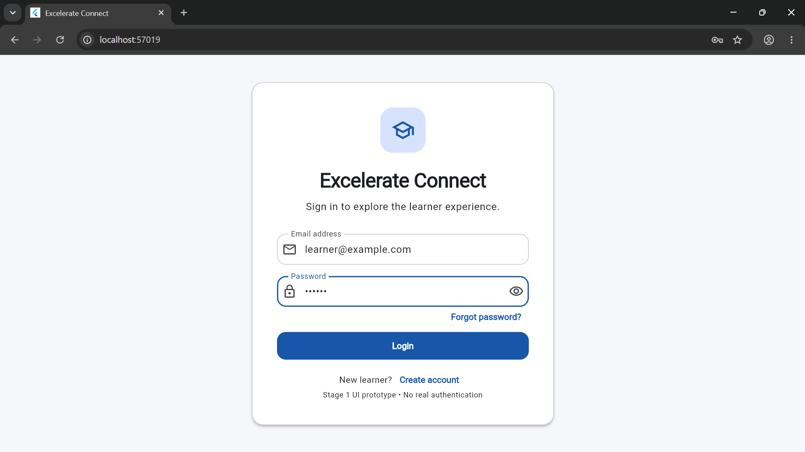
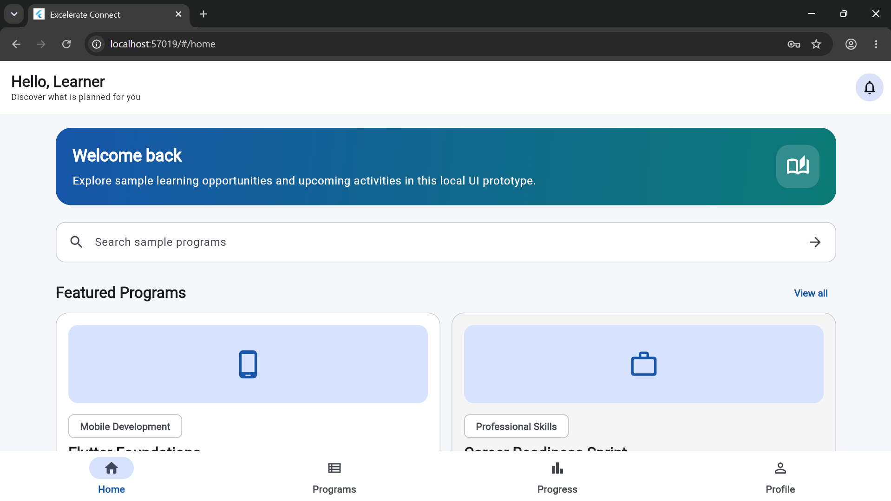
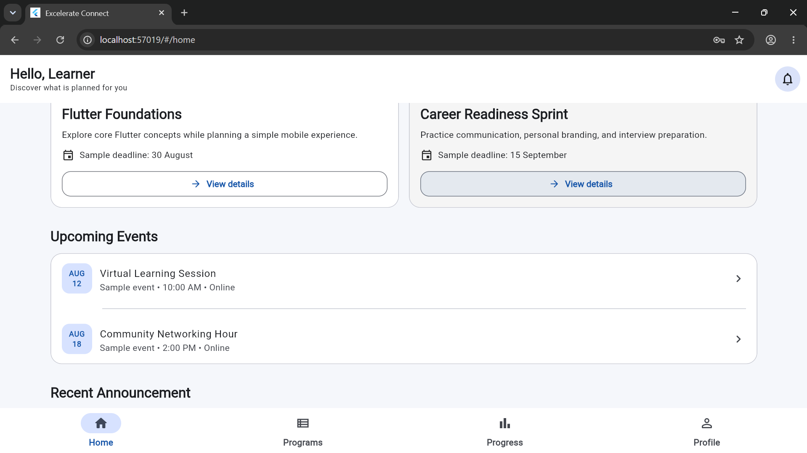
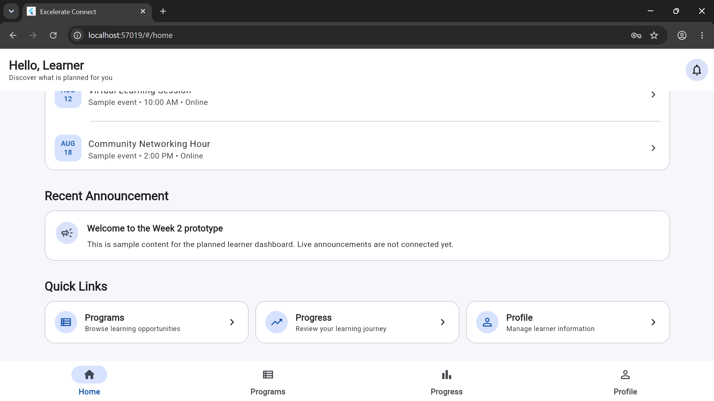
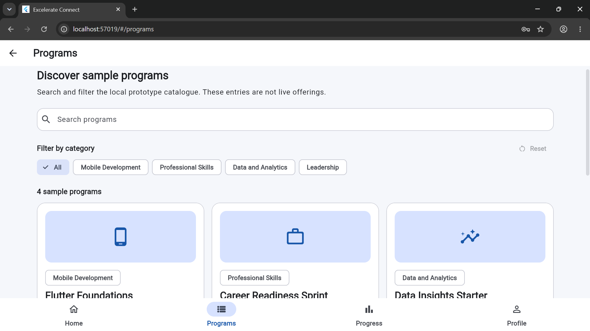
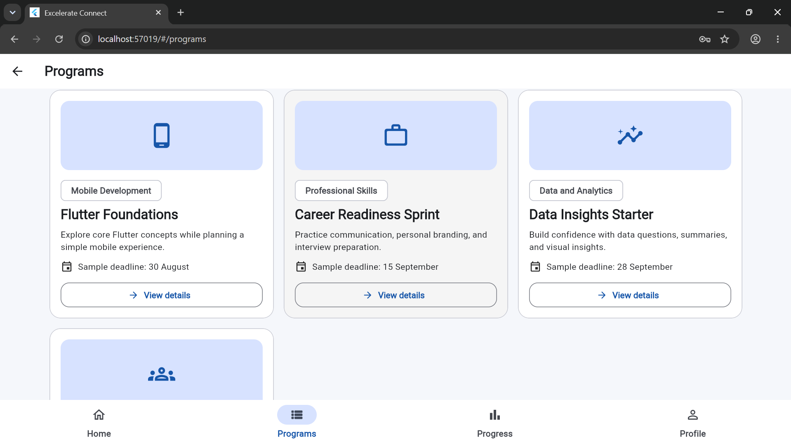
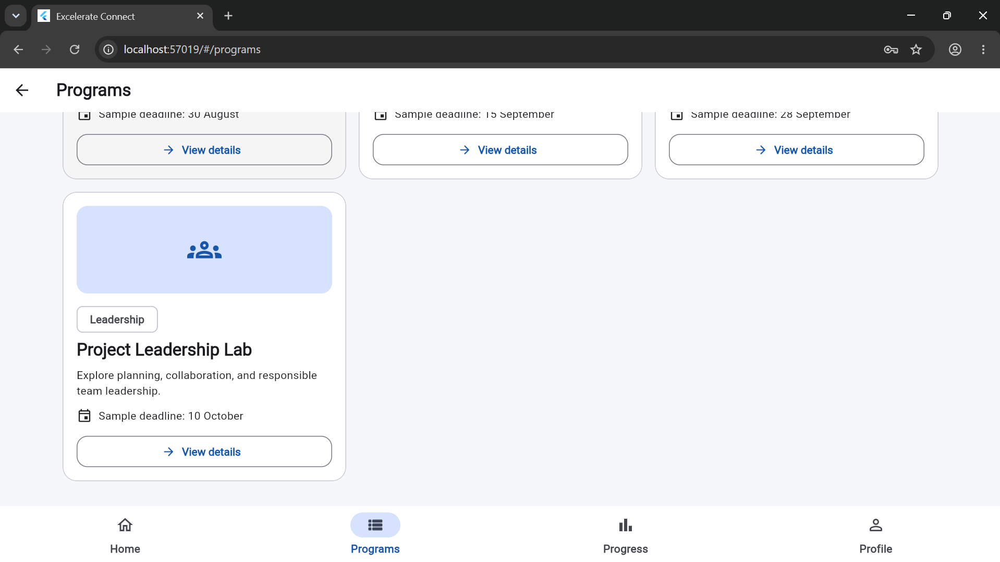
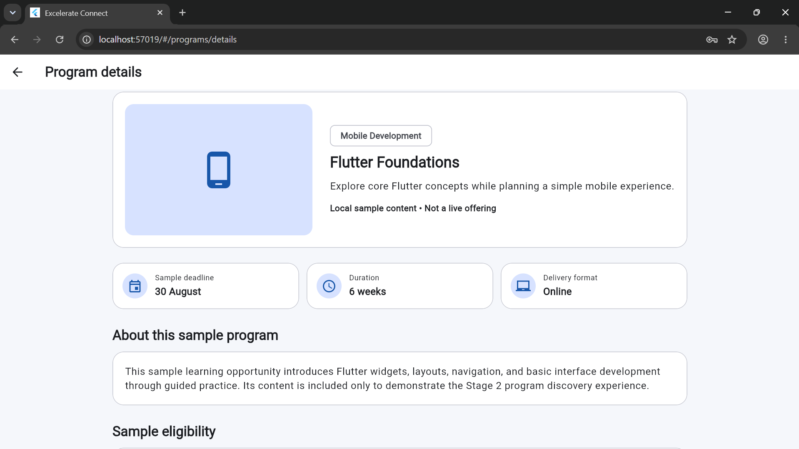
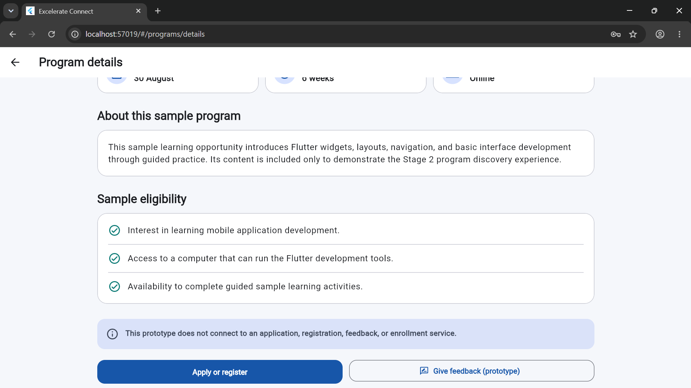

# Excelerate Connect — Week 2 Deliverable

| Project information | Details |
| --- | --- |
| Student | Francis Kwarteng |
| Internship | Mobile App Development with Flutter Virtual Internship |
| Deliverable | Week 2 Working UI Prototype |
| Repository application name | Excelerate Connect |

## Week 2 Objective

The Week 2 objective was to move the project from planning into a working Flutter user-interface prototype. This stage replaced the default Flutter counter application with a responsive, themed experience containing a Login Screen, Home Screen, Program Listing Screen, and Program Details Screen. It also introduced local navigation, login-form validation, program search, and category filtering without connecting any backend service.

## Project Overview

Excelerate Connect is a planned mobile application intended to help learners discover learning programs and events, read program information and announcements, track learning progress, manage a profile, and provide feedback. The current Week 2 repository represents a front-end prototype of the learner discovery flow. Its content is local and illustrative; it does not provide live services or persistent user data.

## Implemented Screens

### Login Screen

The Login Screen provides a responsive, centred sign-in form with a text-based Excelerate Connect wordmark, introductory learner text, email and password fields, a password visibility control, and prototype actions for password recovery and account creation. Valid form input opens the Home Screen. No real authentication or account service is connected.

### Home Screen

The Home Screen includes a learner greeting, notification placeholder, welcome banner, program-search entry point, featured sample programs, upcoming sample events, a recent static announcement, quick links, and bottom navigation. Programs is connected to the implemented listing flow; Progress, Profile, and notifications remain later-stage placeholders.

### Program Listing Screen

The Program Listing Screen displays local sample programs in responsive cards. It includes a search field, category filters, a reset action, a result count, an empty state, program metadata, and View details actions. Its grid adapts across mobile and wider browser widths.

### Program Details Screen

The Program Details Screen receives the selected local Program object and presents its title, category, description, sample deadline, duration, delivery format, and eligibility information. Apply or Register and Give Feedback actions display honest prototype messages because application and feedback services have not been implemented.

## Navigation Flow

The implemented learner flow is:

> Login → Home → Program Listing → Program Details

Additional implemented entry and return paths include:

- Home bottom-navigation Programs item → Program Listing
- Home Programs quick link → Program Listing
- Home Featured Programs View all action → Program Listing
- Home search submission → Program Listing with the entered search query
- Home featured-program action → the corresponding Program Details Screen
- Program Listing card or View details action → the selected Program Details Screen
- Program Details back action → the previous screen, normally Program Listing

Successful login uses replacement navigation so that an accidental Back action does not immediately return the learner to the Login Screen. Normal push-and-pop navigation is retained between the listing and details screens.

## Search and Category-Filter Functionality

Program discovery operates entirely on the local sample-data collection:

- Search matches program titles, categories, short descriptions, and full descriptions without case sensitivity.
- Category controls include an All option and the categories represented by the sample programs.
- Search text and category selection work together to refine the visible results.
- Reset restores the complete local program collection.
- A clear empty-state message appears when no program matches the current query and filter.
- A search entered on the Home Screen is passed to the Program Listing Screen.

These controls do not query an API or live program catalogue.

## Login Form Validation

The Login Screen uses a Flutter Form with client-side validation:

- Email is required and must use a reasonably formatted email address.
- Password is required.
- The password can be shown or hidden using the field control.
- Invalid submission presents field-level messages and a SnackBar.
- Valid prototype input navigates to Home.

Validation demonstrates user-interface behaviour only. Credentials are not authenticated, transmitted, stored, or registered.

## Responsive Layout and Visual Identity

The interface uses Material 3 with a reusable light theme, consistent typography, cards, form fields, buttons, and navigation styling. A professional blue primary colour and complementary teal accent create an Excelerate-inspired visual identity; these colours are not presented as official brand colours, and no unprovided logo or trademark asset is used.

Layouts are scrollable and constrained for small mobile screens while using available width on Chrome and other wider displays. Program cards change column count at responsive breakpoints, and controls use readable text, appropriate contrast, labels, and practical tap targets.

## Technologies Used

- Flutter for the cross-platform application interface
- Dart for application logic, models, local sample data, navigation, and tests
- Flutter Material widgets and Material 3 theming
- Flutter's built-in widget-testing framework
- Git for local version control
- GitHub as the configured remote repository host

No third-party runtime package, database, API, authentication provider, or backend service was introduced for this prototype.

## Testing Completed

The Week 2 implementation was formatted and validated after the Program Listing and Program Details work:

- Dart formatting checked 15 files; no formatting changes were required.
- flutter analyze completed with no issues.
- flutter test completed with all 16 widget tests passing.
- flutter build web completed successfully, including the WebAssembly dry-run check.
- Manual Chrome checks were completed at representative mobile and desktop viewport sizes. The tested flows showed no visible layout overflow or browser-console error.

Automated tests cover login validation and navigation, Home content and program entry points, sample-program rendering, case-insensitive search, empty and reset states, category filtering, selected-program details, prototype action messages, and back navigation to the filtered listing.

## Week 2 Screenshots

The following screenshots document the working local UI prototype in learner-flow order.

### 1. Login Screen

*Caption: Responsive learner sign-in interface.*

This screenshot demonstrates the centred login form, text-based project identity, email and password inputs, password visibility control, and primary Login action. The screen validates input locally but is not connected to authentication.

### 2. Home Screen — Top

*Caption: Home header, welcome content, and program-search entry point.*

This view demonstrates the learner greeting, notification placeholder, welcome banner, and search control at the top of the responsive Home Screen.

### 3. Home Screen — Programs and Events

*Caption: Featured local programs and upcoming sample events.*

This screenshot shows the featured-program cards and upcoming-events section. The displayed content is static sample data used to demonstrate layout and navigation.

### 4. Home Screen — Announcement and Quick Links

*Caption: Recent announcement, quick links, and learner navigation.*

This view demonstrates the static recent-announcement card and quick links. Programs opens the implemented listing; Progress and Profile remain clearly limited to later development.

### 5. Program Listing — Search and Filters

*Caption: Local program search, category filters, and reset control.*

This screenshot demonstrates the Programs header, searchable local catalogue, category controls, reset action, and visible result count.

### 6. Program Listing — Program Cards

*Caption: Responsive cards for locally defined sample programs.*

This view shows program titles, categories, short descriptions, sample deadlines, visual identifiers, and View details actions arranged without requiring live data.

### 7. Program Listing — Bottom

*Caption: Scrollable listing content and persistent bottom navigation.*

This screenshot demonstrates the lower portion of the program collection and the bottom navigation used to return Home or access the Programs area.

### 8. Program Details — Top

*Caption: Selected-program identity, metadata, and overview.*

This view demonstrates how the selected Program object supplies the details header, category, description, sample deadline, duration, delivery format, and About content.

### 9. Program Details — Bottom

*Caption: Eligibility content and transparent prototype actions.*

This screenshot shows the eligibility requirements, prototype limitation notice, and Apply or Register and Give Feedback actions. Both actions provide informational messages rather than submitting data.

## Current Prototype Limitations

The Week 2 deliverable is a working front-end prototype with the following boundaries:

- Login validation is local; there is no real authentication, account creation, password recovery, or session service.
- Program, event, and announcement content is static sample data, not a live catalogue.
- Apply or Register does not enroll a learner or submit an application.
- Give Feedback does not open a completed feedback workflow, store feedback, or send a submission.
- No API, database, backend, cloud storage, or persistent local account data is connected.
- Progress, Profile, notification, administrator, and participation-management features remain planned.
- No official Excelerate logo or unprovided branding asset is used.
- The project is not presented as a deployed production service.

## GitHub Repository

The configured remote repository is [Excelerate Connect on GitHub](https://github.com/franciskwarteng677/excelerate-connect).

This section identifies the repository location only. The current working-tree changes, screenshots, and this deliverable may not yet be present in the remote repository. No commit, push, publication, or deployment is performed as part of this documentation task.

## Conclusion

Week 2 establishes a coherent Flutter UI foundation and a navigable four-screen learner journey. The prototype demonstrates responsive presentation, validation, local program discovery, filtering, and selected-program details while clearly separating implemented interface behaviour from future backend-dependent capabilities. It provides a tested base for later functionality without claiming live authentication, enrollment, feedback, or data services.
