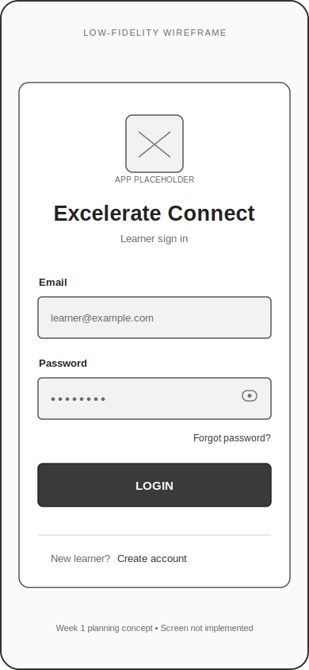
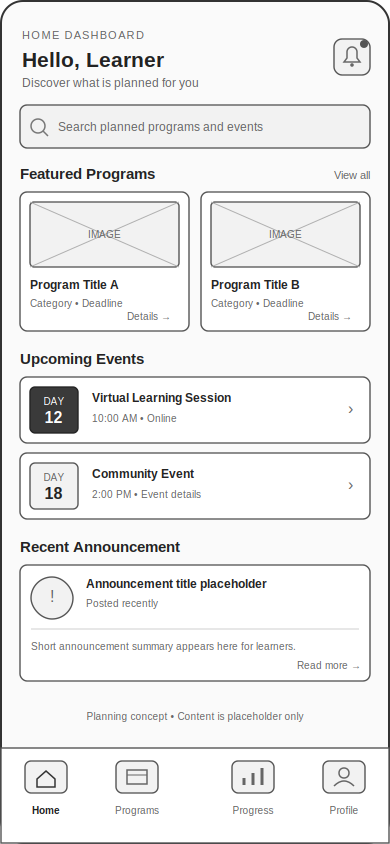
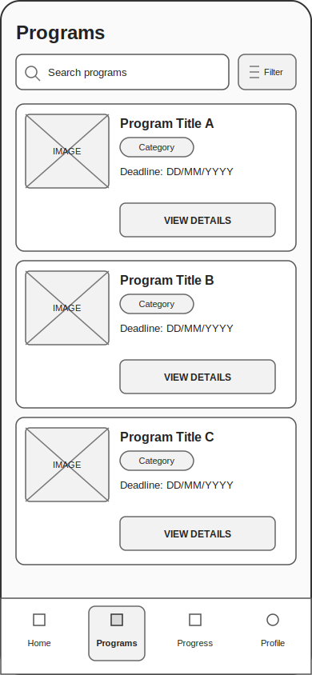
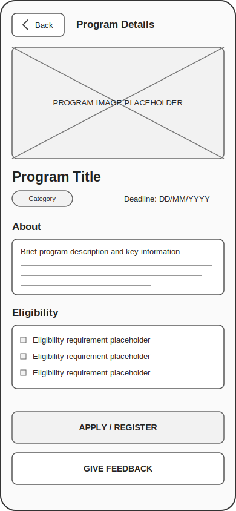
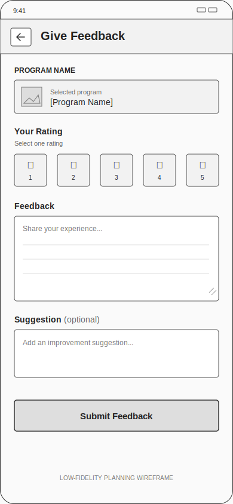
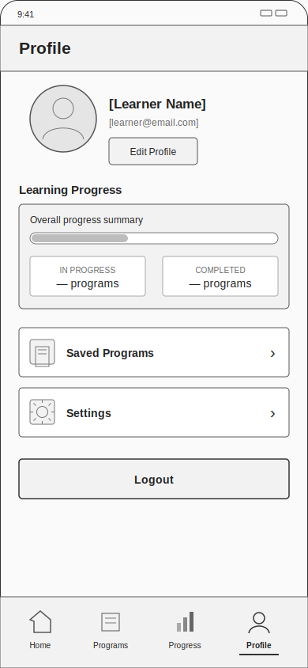
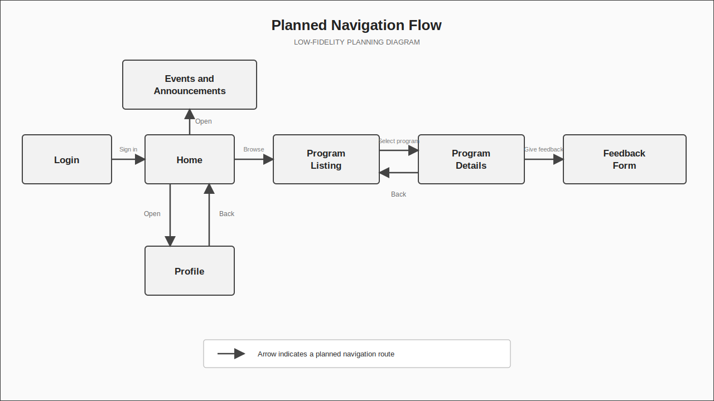

# Excelerate Connect — Low-Fidelity Wireframes

## Purpose

These Week 1 wireframes document the planned structure, content hierarchy, and navigation of the Excelerate Connect learner experience before application-screen development begins. They use grayscale boxes, labels, and placeholders so that the team can review the proposed flow without implying a finished visual design or official Excelerate branding.

## 1. Login

The planned login screen provides a simple entry point for learners. Its principal elements are the Excelerate Connect text title, email and password fields, a primary login button, and links for password recovery and account creation.

[Open the login wireframe](wireframes/01-login.svg)

## 2. Home Dashboard

The planned home dashboard introduces the learner with a greeting and provides quick access to important content. It includes a notification placeholder, search field, featured programs, upcoming events, a recent announcement, and bottom navigation for Home, Programs, Progress, and Profile.

[Open the home dashboard wireframe](wireframes/02-home.svg)

## 3. Program Listing

The planned program listing supports browsing and finding learning opportunities. It includes a page title, search field, filter control, multiple program cards, and bottom navigation. Each program card presents a placeholder image, title, category, deadline, and View Details action.

[Open the program listing wireframe](wireframes/03-program-listing.svg)

## 4. Program Details

The planned program details screen organizes information about a selected opportunity. It includes a back control, image placeholder, program title, category and deadline, About and Eligibility sections, and planned Apply or Register and Give Feedback actions.

[Open the program details wireframe](wireframes/04-program-details.svg)

## 5. Feedback Form

The planned feedback form gives learners a structured way to respond to a program experience. It includes a back control, program name, rating control, main feedback area, optional suggestion field, and Submit Feedback button.

[Open the feedback form wireframe](wireframes/05-feedback-form.svg)

## 6. Profile

The planned profile screen groups learner information and account-related destinations. It includes a profile-image placeholder, learner name and email, Edit Profile action, learning-progress summary, saved programs, settings, logout, and the shared bottom navigation.

[Open the profile wireframe](wireframes/06-profile.svg)

## Navigation Flow

The navigation diagram captures the proposed primary journey from Login through Feedback Form, supporting paths from Home to Events and Announcements and Profile, and return paths from Program Details to Program Listing and from Profile to Home.

[Open the navigation flow diagram](wireframes/navigation-flow.svg)

## Planning Status

These are low-fidelity planning designs only. They are not implemented application screens, do not represent final visual styling, and do not claim official Excelerate branding. Layouts and interactions may be refined during later design and development stages.
